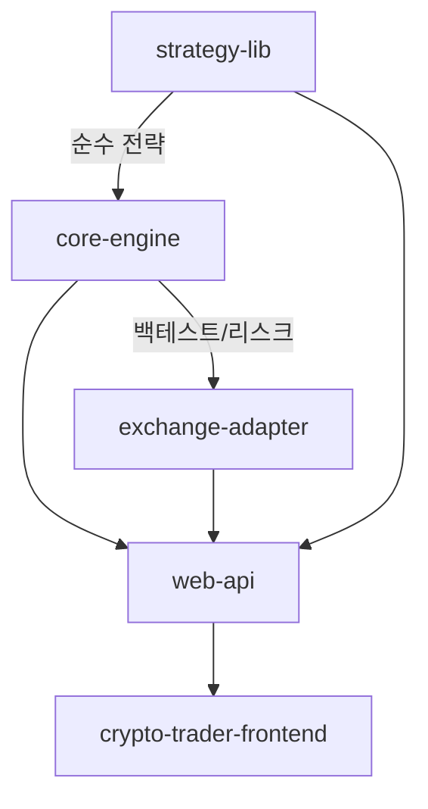

# 🔍 Crypto Auto Trader — 프로젝트 종합 분석 보고서

> **분석 일시**: 2026-03-15  
> **프로젝트 경로**: `d:\Claude Code\projects\crypto-auto-trader`  
> **프로젝트 버전**: v0.1.0

---

## 1. 프로젝트 개요

**Crypto Auto Trader**는 업비트(Upbit) 거래소를 대상으로 한 **암호화폐 자동매매 시스템**으로, 백엔드(Spring Boot + Gradle 멀티모듈)와 프론트엔드(Next.js)로 구성되어 있다.

### 핵심 기능
- **10개 매매 전략** (EMA Cross, VWAP, Bollinger, MACD, RSI, Grid, Supertrend, ATR Breakout, Orderbook Imbalance, Stochastic RSI)
- **백테스팅 엔진** (Look-Ahead Bias 방지, Fill Simulation, Walk Forward 테스트)
- **모의매매 (Paper Trading)** — 가상 잔고 기반 전략 검증
- **실전매매 (Live Trading)** — 다중 세션, 거래소 주문, 손절/비상정지
- **리스크 관리** — 일별/주별/월별 손실 한도, 최대 포지션 수 제한
- **시장 레짐 감지** — TREND/RANGE/VOLATILE 분류
- **텔레그램 알림** — 매매/손절/세션 상태 실시간 알림
- **대시보드 프론트엔드** — 차트, 성과 비교, 전략 관리 UI

---

## 2. 아키텍처 분석

### 2.1 모듈 구조

```
crypto-auto-trader/
├── strategy-lib          # 순수 전략 로직 (외부 의존성 없음)
├── core-engine           # 백테스트/리스크/포트폴리오/메트릭스
├── exchange-adapter      # 업비트 API 연동 (REST + WebSocket + 주문)
├── web-api               # Spring Boot 어플리케이션 (Controller/Service/Entity)
├── crypto-trader-frontend# Next.js 16 프론트엔드
└── docs/                 # 설계 문서, API 스펙, 진행 현황
```

### 2.2 의존성 구조



| 모듈 | 역할 | 주요 의존성 |
|------|------|-------------|
| `strategy-lib` | 전략 인터페이스 + 10개 전략 구현 | 없음 (순수 Java) |
| `core-engine` | 백테스트 엔진, 리스크 엔진, 포트폴리오, 메트릭스 | strategy-lib |
| `exchange-adapter` | 업비트 REST/WebSocket/주문 클라이언트 | core-engine, WebFlux, JJWT |
| `web-api` | REST API, JPA 엔티티, 서비스 레이어 | 전 모듈, Spring Boot, PostgreSQL, Redis, Flyway |
| `crypto-trader-frontend` | 대시보드 UI | Next.js 16, React 19, TanStack Query, Recharts, Zustand |

### 2.3 기술 스택

| 계층 | 기술 |
|------|------|
| Backend | Java 17, Spring Boot 3.2.5, Gradle |
| Database | PostgreSQL 15 (TimescaleDB), Redis 7 |
| Frontend | Next.js 16, React 19, TypeScript 5, TailwindCSS 4 |
| DevOps | Docker Compose, Flyway 마이그레이션 |
| 외부 API | Upbit REST API v1, Upbit WebSocket v1 |
| 보안 | JWT (HMAC-SHA256), AES-256 키 암호화 |
| 기타 | Swagger (springdoc-openapi), Playwright E2E, MSW Mock |

### 2.4 아키텍처 평가

| 항목 | 평가 | 설명 |
|------|------|------|
| 모듈 분리 | ⭐⭐⭐⭐ | strategy-lib의 무의존성 설계가 우수. 거래소 어댑터 패턴 적용 |
| 확장성 | ⭐⭐⭐⭐ | ExchangeAdapter 인터페이스로 타 거래소 추가 가능 |
| 테스트 | ⭐⭐⭐ | core-engine, strategy-lib에 단위 테스트 존재. 서비스 레이어 테스트 부족 |
| 보안 | ⭐⭐⭐ | API Key char[] 관리, AES-256 환경변수. 일부 보안 개선 필요 |
| 코드 품질 | ⭐⭐⭐ | 전반적으로 양호하나 일부 개선사항 존재 |

---

## 3. 모듈별 상세 분석

### 3.1 strategy-lib (전략 라이브러리)

**파일 수**: 26 Java (main), 8 테스트  
**설계 패턴**: Strategy 패턴 + Registry

#### 구현된 전략

| 전략 | 분류 | 설명 |
|------|------|------|
| VWAP | 역추세 | 거래량 가중 평균 가격 기반 |
| EMA_CROSS | 추세추종 | 단기/장기 EMA 크로스 |
| BOLLINGER | 평균회귀 | 볼린저 밴드 %B 기반 |
| GRID | 레인지 | 가격 그리드 레벨 매매 |
| RSI | 역추세 | 과매수/과매도 영역 감지 |
| MACD | 추세추종 | MACD/Signal 크로스 |
| SUPERTREND | 추세추종 | ATR 기반 동적 지지/저항 |
| ATR_BREAKOUT | 모멘텀 | ATR 변동성 돌파 |
| ORDERBOOK_IMBALANCE | 단기 | 호가 불균형 (WebSocket 연동 필요) |
| STOCHASTIC_RSI | 복합 | RSI에 Stochastic 적용 |

#### 평가
- ✅ [Strategy](file:///d:/Claude%20Code/projects/crypto-auto-trader/strategy-lib/src/main/java/com/cryptoautotrader/strategy/Strategy.java#6-14) 인터페이스로 깔끔한 추상화
- ✅ [IndicatorUtils](file:///d:/Claude%20Code/projects/crypto-auto-trader/strategy-lib/src/main/java/com/cryptoautotrader/strategy/IndicatorUtils.java#11-164)로 SMA/EMA/ATR/ADX 등 지표 계산 공용화
- ✅ 모든 전략에 단위 테스트 존재
- ⚠️ [StrategyRegistry](file:///d:/Claude%20Code/projects/crypto-auto-trader/strategy-lib/src/main/java/com/cryptoautotrader/strategy/StrategyRegistry.java#17-55)가 static 초기화 — 동적 전략 등록/해제 제한

---

### 3.2 core-engine (핵심 엔진)

**파일 수**: 18 Java (main), 6 테스트

#### 주요 클래스

| 클래스 | 역할 |
|--------|------|
| [BacktestEngine](file:///d:/Claude%20Code/projects/crypto-auto-trader/core-engine/src/main/java/com/cryptoautotrader/core/backtest/BacktestEngine.java#24-187) | 백테스팅 실행 (Look-Ahead Bias 방지, Fill Simulation) |
| `WalkForwardTestRunner` | Walk Forward 과적합 검증 |
| `FillSimulator` | 시장 충격 + Partial Fill 시뮬레이션 |
| [RiskEngine](file:///d:/Claude%20Code/projects/crypto-auto-trader/core-engine/src/main/java/com/cryptoautotrader/core/risk/RiskEngine.java#11-37) | 일/주/월 손실 한도, 최대 포지션 수 제한 |
| [PortfolioManager](file:///d:/Claude%20Code/projects/crypto-auto-trader/core-engine/src/main/java/com/cryptoautotrader/core/portfolio/PortfolioManager.java#16-91) | 자본 할당, 전략 간 충돌 방지 |
| [MetricsCalculator](file:///d:/Claude%20Code/projects/crypto-auto-trader/core-engine/src/main/java/com/cryptoautotrader/core/metrics/MetricsCalculator.java#15-212) | 8가지 성과 지표 (Sharpe, Sortino, Calmar, MDD 등) |
| `MarketRegimeDetector` | TREND/RANGE/VOLATILE 시장 분류 |

#### 평가
- ✅ BigDecimal 사용으로 금융 연산 정밀도 확보
- ✅ Look-Ahead Bias 방지 설계 (현재 캔들 신호 → 다음 캔들 체결)
- ✅ 월별 수익률, 최대 연속 손실 등 포괄적 메트릭스
- ⚠️ BacktestEngine에서 매수 시 수수료를 capital에서 빼지만, BUY 레코드의 PnL은 항상 0 — 실제 PnL 정확도에 영향

---

### 3.3 exchange-adapter (거래소 어댑터)

**파일 수**: 10 Java

#### 주요 클래스

| 클래스 | 역할 |
|--------|------|
| [ExchangeAdapter](file:///d:/Claude%20Code/projects/crypto-auto-trader/exchange-adapter/src/main/java/com/cryptoautotrader/exchange/adapter/ExchangeAdapter.java#13-21) | 거래소 추상화 인터페이스 |
| [UpbitRestClient](file:///d:/Claude%20Code/projects/crypto-auto-trader/exchange-adapter/src/main/java/com/cryptoautotrader/exchange/upbit/UpbitRestClient.java#21-75) | REST API 캔들 데이터 조회 |
| [UpbitWebSocketClient](file:///d:/Claude%20Code/projects/crypto-auto-trader/exchange-adapter/src/main/java/com/cryptoautotrader/exchange/upbit/UpbitWebSocketClient.java#32-395) | 실시간 시세/체결 데이터 수신 |
| [UpbitOrderClient](file:///d:/Claude%20Code/projects/crypto-auto-trader/exchange-adapter/src/main/java/com/cryptoautotrader/exchange/upbit/UpbitOrderClient.java#31-332) | JWT 인증 기반 주문 생성/조회/취소 |
| `UpbitCandleCollector` | 캔들 데이터 수집기 |

#### 평가
- ✅ WebSocket 자동 재연결 (지수 백오프)
- ✅ GZIP 바이너리 디코딩 + plain text 폴백
- ✅ API Key를 `char[]`로 관리 (보안 강화)
- ✅ Ping/Pong 120초 간격 헬스체크
- ⚠️ `UpbitCandleCollector`가 [ExchangeAdapter](file:///d:/Claude%20Code/projects/crypto-auto-trader/exchange-adapter/src/main/java/com/cryptoautotrader/exchange/adapter/ExchangeAdapter.java#13-21)를 구현하지만 [UpbitRestClient](file:///d:/Claude%20Code/projects/crypto-auto-trader/exchange-adapter/src/main/java/com/cryptoautotrader/exchange/upbit/UpbitRestClient.java#21-75)와 중복 가능성

---

### 3.4 web-api (웹 API)

**파일 수**: 61+ Java  
**Controllers**: 7개 | **Services**: 12개 | **Entities**: 16개 | **Repositories**: 10+개

#### 서비스 레이어

| 서비스 | 역할 |
|--------|------|
| [LiveTradingService](file:///d:/Claude%20Code/projects/crypto-auto-trader/web-api/src/main/java/com/cryptoautotrader/api/service/LiveTradingService.java#42-607) | 다중 세션 실전매매 (최대 5개 동시) |
| [OrderExecutionEngine](file:///d:/Claude%20Code/projects/crypto-auto-trader/web-api/src/main/java/com/cryptoautotrader/api/service/OrderExecutionEngine.java#48-478) | 6단계 상태머신 주문 처리 |
| `PaperTradingService` | 모의매매 세션 관리 |
| `BacktestService` | 백테스트 실행 + 결과 저장 |
| `DataCollectionService` | 캔들 데이터 수집 |
| `RiskManagementService` | 리스크 체크 + 설정 관리 |
| `ExchangeHealthMonitor` | 거래소 연결 모니터링 |
| `MarketRegimeAwareScheduler` | 시장 상태별 전략 자동 스위칭 |
| `TelegramNotificationService` | 텔레그램 알림 전송 |
| `PositionService` | 포지션 관리 |
| `MarketDataSyncService` | 시장 데이터 동기화 |

#### 평가
- ✅ RESTful API 설계 (명확한 리소스 기반 URL)
- ✅ 비상정지(Emergency Stop) 메커니즘 구현
- ✅ 손절(Stop Loss) 자동 발동
- ✅ 5초 간격 주문 상태 폴링 + 5분 타임아웃 자동 취소
- ✅ `@Transactional` 적절한 사용
- ⚠️ 서비스 레이어 단위 테스트 부재

---

### 3.5 crypto-trader-frontend (프론트엔드)

**파일 수**: 45 TS/TSX  
**프레임워크**: Next.js 16, React 19

#### 페이지 구조

| 페이지 | 경로 | 기능 |
|--------|------|------|
| 대시보드 | `/` | 전체 현황 |
| 백테스트 | `/backtest` | 백테스트 실행/결과/비교 |
| 전략 관리 | `/strategies` | 전략 목록/활성화/설정 |
| 실전 매매 | `/trading` | 세션 관리, 리스크 설정 |
| 모의매매 | `/paper-trading` | 모의매매 세션 |
| 데이터 관리 | `/data` | 캔들 데이터 수집/삭제 |
| 로그 | `/logs` | 전략 실행 로그 |

#### 평가
- ✅ TanStack Query로 서버 상태 관리
- ✅ Zustand로 UI 상태 관리
- ✅ MSW(Mock Service Worker)로 API 모킹
- ✅ Playwright E2E 테스트 구성
- ✅ Recharts 차트 컴포넌트 (Cumulative PnL, Monthly Returns)
- ⚠️ 프론트엔드 [StrategyType](file:///d:/Claude%20Code/projects/crypto-auto-trader/crypto-trader-frontend/src/lib/types.ts#7-8) 타입이 4개만 정의 — 백엔드의 10개와 불일치

---

## 4. 🐛 발견된 버그 및 오류

### 4.1 🔴 CRITICAL — [MetricsCalculator](file:///d:/Claude%20Code/projects/crypto-auto-trader/core-engine/src/main/java/com/cryptoautotrader/core/metrics/MetricsCalculator.java#15-212)의 Calmar/Recovery Factor 동일 계산

**파일**: [MetricsCalculator.java](file:///d:/Claude%20Code/projects/crypto-auto-trader/core-engine/src/main/java/com/cryptoautotrader/core/metrics/MetricsCalculator.java#L86-L91)

```java
BigDecimal calmarRatio = mddPct.compareTo(BigDecimal.ZERO) == 0
        ? BigDecimal.ZERO
        : totalReturnPct.divide(mddPct.abs(), SCALE, RoundingMode.HALF_UP);
BigDecimal recoveryFactor = mddPct.compareTo(BigDecimal.ZERO) == 0
        ? BigDecimal.ZERO
        : totalReturnPct.divide(mddPct.abs(), SCALE, RoundingMode.HALF_UP);
```

**문제**: `calmarRatio`와 `recoveryFactor`가 **완전히 동일한 수식**이다.
- **Calmar Ratio** = 연환산 수익률 / MDD (연환산 필요)
- **Recovery Factor** = 총 수익 / 최대 손실금액 (절대값)

**영향**: 백테스트 결과의 Calmar Ratio가 부정확하게 표시됨.

---

### 4.2 🔴 CRITICAL — [BacktestEngine](file:///d:/Claude%20Code/projects/crypto-auto-trader/core-engine/src/main/java/com/cryptoautotrader/core/backtest/BacktestEngine.java#24-187) BUY 시 수수료 이중 처리 가능성

**파일**: [BacktestEngine.java](file:///d:/Claude%20Code/projects/crypto-auto-trader/core-engine/src/main/java/com/cryptoautotrader/core/backtest/BacktestEngine.java#L80-L114)

```java
// BUY 로직 (라인 96-100):
BigDecimal fee = executionPrice.multiply(orderQuantity).multiply(config.getFeePct())
    .divide(BigDecimal.valueOf(100), SCALE, RoundingMode.HALF_UP);
position = orderQuantity;
entryPrice = executionPrice;
capital = capital.subtract(executionPrice.multiply(orderQuantity)).subtract(fee);
```

```java
// SELL 로직 (라인 123-127):
BigDecimal fee = executionPrice.multiply(position).multiply(config.getFeePct())
    .divide(BigDecimal.valueOf(100), SCALE, RoundingMode.HALF_UP);
BigDecimal pnl = executionPrice.subtract(entryPrice).multiply(position).subtract(fee);
// ...
capital = capital.add(executionPrice.multiply(position)).subtract(fee);
```

**문제**: BUY 시 `capital`에서 수수료를 차감하지만, SELL 시 `pnl` 계산에서 매수 수수료는 반영하지 않는다. 매수 수수료가 PnL에 누락되어 **실제 수익보다 과대 계산**될 수 있다.

---

### 4.3 🟡 MEDIUM — [LiveTradingService](file:///d:/Claude%20Code/projects/crypto-auto-trader/web-api/src/main/java/com/cryptoautotrader/api/service/LiveTradingService.java#42-607) 세션 총자산 업데이트 경쟁 조건

**파일**: [LiveTradingService.java](file:///d:/Claude%20Code/projects/crypto-auto-trader/web-api/src/main/java/com/cryptoautotrader/api/service/LiveTradingService.java#L517-L519)

```java
session.setAvailableKrw(session.getAvailableKrw().add(netProceeds));
session.setTotalAssetKrw(session.getAvailableKrw()); // ← 여기서 availableKrw만 반영
sessionRepository.save(session);
```

**문제**: [executeSessionSell()](file:///d:/Claude%20Code/projects/crypto-auto-trader/web-api/src/main/java/com/cryptoautotrader/api/service/LiveTradingService.java#485-524)에서 매도 후 `totalAssetKrw`를 `availableKrw`로만 설정한다. 만약 다른 코인 포지션이 열려있다면 그 포지션 가치가 `totalAssetKrw`에서 누락된다.

---

### 4.4 🟡 MEDIUM — `OrderExecutionEngine.submitOrder()`에서 `@Async` + `@Transactional` + 리턴값 문제

**파일**: [OrderExecutionEngine.java](file:///d:/Claude%20Code/projects/crypto-auto-trader/web-api/src/main/java/com/cryptoautotrader/api/service/OrderExecutionEngine.java#L83-L138)

```java
@Transactional
@Async("orderExecutor")
public OrderEntity submitOrder(OrderRequest request) {
    // ...
    return order;
}
```

**문제**: `@Async`가 적용된 메서드는 별도 스레드에서 비동기 실행되므로, 호출자가 받는 리턴값은 **프록시 객체의 Future가 아닌 null이 될 수 있다**. 그러나 `LiveTradingService.executeSessionBuy()`에서는 이 리턴값을 즉시 사용한다:
```java
OrderEntity submitted = orderExecutionEngine.submitOrder(order);
if (submitted != null) {  // @Async라면 항상 null일 수 있음
    submitted.setSessionId(session.getId());
```

**참고**: Spring에서 `@Async` 메서드의 리턴 타입이 `void`가 아니고 `Future/CompletableFuture`가 아니면, 리턴값은 무시된다. 현재 코드에서는 같은 클래스 내 호출이 아니라 서비스 빈 주입을 통해 호출하는 것으로 보이므로 프록시가 적용되겠지만, **비동기 실행 완료 전에 리턴값을 사용하는 것은 위험**하다.

---

### 4.5 🟡 MEDIUM — 프론트엔드 [StrategyType](file:///d:/Claude%20Code/projects/crypto-auto-trader/crypto-trader-frontend/src/lib/types.ts#7-8) 타입 불일치

**파일**: [types.ts](file:///d:/Claude%20Code/projects/crypto-auto-trader/crypto-trader-frontend/src/lib/types.ts#L7)

```typescript
export type StrategyType = 'VWAP' | 'EMA_CROSS' | 'BOLLINGER' | 'GRID';
```

**문제**: 백엔드에는 10개 전략(RSI, MACD, SUPERTREND, ATR_BREAKOUT, ORDERBOOK_IMBALANCE, STOCHASTIC_RSI 추가)이 등록되어 있지만, 프론트엔드 [StrategyType](file:///d:/Claude%20Code/projects/crypto-auto-trader/crypto-trader-frontend/src/lib/types.ts#7-8)에는 4개만 정의되어 있다. 백테스트 폼 등에서 Phase 3 전략을 선택하면 **TypeScript 타입 에러가 발생할 수 있다**.

---

### 4.6 🟡 MEDIUM — [BacktestEngine](file:///d:/Claude%20Code/projects/crypto-auto-trader/core-engine/src/main/java/com/cryptoautotrader/core/backtest/BacktestEngine.java#24-187) Partial Fill 이월 시 `continue` 문제

**파일**: [BacktestEngine.java](file:///d:/Claude%20Code/projects/crypto-auto-trader/core-engine/src/main/java/com/cryptoautotrader/core/backtest/BacktestEngine.java#L50-L73)

```java
if (pendingQuantity.compareTo(BigDecimal.ZERO) > 0 && fillSimulator != null) {
    // ... Partial Fill 처리 ...
    continue; // ← 전략 신호 평가를 건너뜀
}
```

**문제**: Partial Fill 이월이 남아있으면 해당 캔들에서 **전략 신호 평가를 완전히 건너뛴다**. 만약 시장 급변 시 매도 신호가 발생해도 이를 무시하고 추가 매수 이월만 계속 진행할 수 있다.

---

### 4.7 🟢 LOW — [UpbitOrderClient](file:///d:/Claude%20Code/projects/crypto-auto-trader/exchange-adapter/src/main/java/com/cryptoautotrader/exchange/upbit/UpbitOrderClient.java#31-332) JWT에서 secret key String 누출 가능성

**파일**: [UpbitOrderClient.java](file:///d:/Claude%20Code/projects/crypto-auto-trader/exchange-adapter/src/main/java/com/cryptoautotrader/exchange/upbit/UpbitOrderClient.java#L253-L266)

```java
String secretKeyStr = new String(secretKey);
SecretKeySpec keySpec = new SecretKeySpec(
        secretKeyStr.getBytes(StandardCharsets.UTF_8), "HmacSHA256");
// secretKeyStr 참조를 즉시 무효화할 수는 없지만...
```

**문제**: `char[]`로 보관한 secret key를 JWT 생성 시마다 `new String(secretKey)`로 변환한다. Java의 String은 immutable이므로 GC 전까지 메모리에 남아 있다. API 호출이 빈번하면 **메모리 덤프에서 시크릿 키가 노출**될 수 있다.

---

### 4.8 🟢 LOW — [UpbitWebSocketClient](file:///d:/Claude%20Code/projects/crypto-auto-trader/exchange-adapter/src/main/java/com/cryptoautotrader/exchange/upbit/UpbitWebSocketClient.java#32-395) scheduler.shutdown() 후 재사용 불가

**파일**: [UpbitWebSocketClient.java](file:///d:/Claude%20Code/projects/crypto-auto-trader/exchange-adapter/src/main/java/com/cryptoautotrader/exchange/upbit/UpbitWebSocketClient.java#L77-L82)

```java
public synchronized void disconnect() {
    shutdownRequested = true;
    disconnectInternal();
    scheduler.shutdown(); // ← 한 번 shutdown 되면 재사용 불가
}
```

**문제**: [disconnect()](file:///d:/Claude%20Code/projects/crypto-auto-trader/exchange-adapter/src/main/java/com/cryptoautotrader/exchange/upbit/UpbitWebSocketClient.java#74-83) 후 다시 [connect()](file:///d:/Claude%20Code/projects/crypto-auto-trader/exchange-adapter/src/main/java/com/cryptoautotrader/exchange/upbit/UpbitWebSocketClient.java#59-73)를 호출하면, `scheduler`가 이미 shutdown 상태이므로 **Ping 스케줄러가 동작하지 않는다**.

---

### 4.9 🟢 LOW — [UpbitRestClient](file:///d:/Claude%20Code/projects/crypto-auto-trader/exchange-adapter/src/main/java/com/cryptoautotrader/exchange/upbit/UpbitRestClient.java#21-75) Rate Limiting 미처리

**파일**: [UpbitRestClient.java](file:///d:/Claude%20Code/projects/crypto-auto-trader/exchange-adapter/src/main/java/com/cryptoautotrader/exchange/upbit/UpbitRestClient.java)

**문제**: Upbit API는 초당 요청 수 제한이 있다 (캔들 API: 초당 10회). 현재 코드에는 **Rate Limiting 로직이 없어**, 대량 데이터 수집 시 429 에러가 발생할 수 있다.

---

## 5. 🚀 개선 권장사항

### 5.1 아키텍처/설계 개선

#### 1) StrategyRegistry 동적 등록 지원
```
현재: static 블록에서 모든 전략을 하드코딩 등록
개선: Spring의 @Component 스캔 또는 ServiceLoader 패턴으로 자동 등록
효과: 새 전략 추가 시 StrategyRegistry 수정 불필요
```

#### 2) 이벤트 기반 아키텍처 도입
```
현재: 60초 폴링 방식으로 전략 실행
개선: WebSocket 실시간 데이터 + 이벤트 드리븐 방식
효과: 빠른 시장 대응, 서버 리소스 효율화
```

#### 3) PortfolioManager를 서비스 레이어에 통합
```
현재: core-engine에 PortfolioManager가 있지만 LiveTradingService에서 사용하지 않음
개선: 실전매매 시 PortfolioManager를 통한 자본 할당/충돌 방지 적용
효과: 다중 세션 간 동일 코인 반대 포지션 방지
```

#### 4) Config 기반 Strategy 초기화
```
현재: getMinimumCandleCount()가 하드코딩 (예: EmaCrossStrategy의 22)
개선: 전략 파라미터(slowPeriod)에 따라 동적 계산
효과: 사용자가 slowPeriod=50으로 변경해도 정확한 최소 캔들 수 보장
```

---

### 5.2 코드 품질 개선

#### 5) StrategyController — Map 대신 DTO 사용
```
현재: Map<String, Object>로 응답 구성 (buildStrategyInfo, toConfigMap)
개선: StrategyInfoDto, StrategyConfigDto 등 전용 DTO 클래스 사용
효과: 타입 안전성, API 문서 자동 생성, IDE 자동완성 지원
```

#### 6) StrategyController.createConfig() — 입력 검증 부재
```java
// 현재: Map<String, Object>를 직접 캐스팅 — ClassCastException 위험
entity.setName((String) body.getOrDefault("name", ""));
entity.setMaxInvestment(new BigDecimal(body.get("maxInvestment").toString()));
```
```
개선: @Valid @RequestBody StrategyCreateRequest 같은 DTO + Bean Validation 적용
효과: 입력 검증, NullPointerException/NumberFormatException 방지
```

#### 7) 예외 처리 일관성
```
현재: 일부 컨트롤러는 ResponseStatusException, 일부는 ApiResponse.error() 사용
개선: GlobalExceptionHandler에서 일관된 에러 응답 포맷으로 통합
효과: 프론트엔드에서 일관된 에러 핸들링 가능
```

#### 8) BacktestRequest 필드명 불일치
```
프론트엔드: slippageRate, feeRate (types.ts)
백엔드: slippagePct, feePct (BacktestRequest.java)
→ 프론트엔드에서 API 호출 시 필드 매핑 혼동 가능
```

---

### 5.3 성능/안정성 개선

#### 9) Upbit API Rate Limiter 추가
```
현재: Rate Limiting 없음 → 429 에러 위험
개선: Resilience4j RateLimiter 또는 Guava RateLimiter 적용
설정: 캔들 API 초당 10회, 주문 API 초당 8회 제한
```

#### 10) BacktestEngine의 subList 성능 문제
```java
List<Candle> window = candles.subList(0, i + 1); // 매 루프마다 호출
```
```
문제: subList는 원본 리스트의 뷰이므로 GC 문제는 없지만,
     전략의 evaluate()가 매번 전체 윈도우를 처리 → O(n²) 복잡도
개선: 전략이 이전 계산 결과를 캐싱하는 incremental 방식 도입
```

#### 11) WebSocket 재연결 시 binaryBuffer 공유 문제
```java
ByteArrayOutputStream binaryBuffer = new ByteArrayOutputStream();
// doConnect() 내부에서 생성되므로 재연결 시 새 리스너에서 새 buffer 사용 → 기존 데이터 손실 없음
// 하지만 이전 연결의 리스너가 여전히 참조하고 있을 수 있음
```
```
개선: doConnect() 호출 전 기존 WebSocket 참조를 확실히 정리
```

#### 12) Database 인덱스 최적화
```
현재: JPA 기본 인덱스만 사용
개선: 다음 쿼리에 복합 인덱스 추가 권장
  - candle_data: (coin_pair, timeframe, time) → DESC
  - orders: (session_id, state) → 활성 주문 조회
  - positions: (session_id, coin_pair, status) → 포지션 조회
```

---

### 5.4 테스트/품질 보증

#### 13) 서비스 레이어 단위 테스트 추가
```
현재: core-engine/strategy-lib에만 테스트 존재
부족: LiveTradingService, OrderExecutionEngine, BacktestService 등 서비스 테스트 없음
개선: Mockito 기반 단위 테스트 추가 (최소 핵심 비즈니스 로직)
```

#### 14) 통합 테스트 추가
```
현재: web-api에 spring-boot-starter-test + H2 의존성은 있으나 테스트 파일 없음
개선: @SpringBootTest + H2로 주요 API 엔드포인트 통합 테스트 작성
```

#### 15) Flyway 마이그레이션 파일 검증
```
현재: flyway-core 의존성은 있으나 마이그레이션 SQL 파일 존재 여부 미확인
점검 필요: src/main/resources/db/migration/ 디렉토리 확인
```

---

### 5.5 프론트엔드 개선

#### 16) StrategyType 타입 동기화
```typescript
// 현재 (4개):
export type StrategyType = 'VWAP' | 'EMA_CROSS' | 'BOLLINGER' | 'GRID';

// 개선 (10개 + 확장 가능):
export type StrategyType = 'VWAP' | 'EMA_CROSS' | 'BOLLINGER' | 'GRID'
    | 'RSI' | 'MACD' | 'SUPERTREND' | 'ATR_BREAKOUT'
    | 'ORDERBOOK_IMBALANCE' | 'STOCHASTIC_RSI';
```

#### 17) API 에러 핸들링 강화
```
현재: axios 인터셉터에 에러 핸들링 로직 없음
개선: 401/403 인증 에러, 429 Rate Limit, 500 서버 에러 등
     각각에 대한 글로벌 에러 핸들링 + 토스트 알림
```

#### 18) 실시간 데이터 WebSocket 연동
```
현재: 프론트엔드에서 API 폴링으로 데이터 갱신
개선: 백엔드에 WebSocket(STOMP) 엔드포인트 추가,
     프론트에서 실시간 가격/포지션/주문 상태 수신
```

---

### 5.6 보안 개선

#### 19) API 인증/인가 추가
```
현재: 모든 API 엔드포인트가 인증 없이 접근 가능
개선: Spring Security + JWT 기반 인증, 또는 최소한 IP 기반 접근 제어
중요도: 실전매매 API가 무방비 상태 → 외부 접근 시 자금 위험
```

#### 20) 환경 변수 검증
```
현재: AES_KEY, API Key 등 필수 환경 변수 누락 시 런타임 에러
개선: 애플리케이션 시작 시 필수 환경 변수 존재 여부 검증 + 명확한 에러 메시지
```

---

### 5.7 DevOps 개선

#### 21) 헬스체크 엔드포인트
```
현재: /api/v1/trading/health/exchange (거래소 상태만)
개선: Spring Actuator 활성화로 /actuator/health 포함
     DB연결, Redis연결, 거래소상태를 통합 헬스체크
```

#### 22) 로깅 구조화
```
현재: SLF4J 기본 로깅
개선: JSON 구조화 로깅 + MDC에 sessionId/orderId 포함
     ELK 스택 또는 CloudWatch 연동 용이
```

#### 23) Docker Compose 서비스 간 의존성
```
현재: depends_on만 사용 (서비스 시작 순서만 보장)
개선: healthcheck + condition: service_healthy 적용
     DB가 fully ready 된 후 backend 시작 보장
```

---

## 6. 우선순위별 작업 권장

### 🔴 즉시 수정 (Critical)

| # | 항목 | 영향도 |
|---|------|--------|
| 1 | MetricsCalculator Calmar/Recovery Factor 수식 수정 | 백테스트 지표 정확도 |
| 2 | BacktestEngine 매수 수수료 PnL 반영 | 수익률 과대 계산 방지 |
| 3 | submitOrder @Async 리턴값 문제 해결 | 실전매매 주문 sessionId 누락 가능 |

### 🟡 단기 개선 (1~2주)

| # | 항목 | 영향도 |
|---|------|--------|
| 4 | StrategyType 프론트/백엔드 동기화 | TypeScript 타입 에러 |
| 5 | LiveTradingService 총자산 계산 수정 | 세션 잔고 정확도 |
| 6 | API 인증/인가 추가 | 보안 취약점 |
| 7 | Upbit Rate Limiter 추가 | 데이터 수집 안정성 |
| 8 | StrategyController DTO 적용 | 코드 품질/타입 안전성 |

### 🟢 중장기 개선 (1~3개월)

| # | 항목 | 영향도 |
|---|------|--------|
| 9 | 서비스 레이어 테스트 작성 | 코드 안정성 |
| 10 | 이벤트 기반 아키텍처 전환 | 응답 속도 향상 |
| 11 | PortfolioManager 실전매매 통합 | 다중 세션 안전성 |
| 12 | WebSocket 실시간 데이터 프론트 연동 | UX 향상 |
| 13 | 구조화 로깅 + 모니터링 | 운영 가시성 |

---

## 7. 총평

이 프로젝트는 **암호화폐 자동매매 시스템으로서 매우 높은 완성도**를 보인다. 특히:

- **모듈 분리**가 잘 되어 있어 전략/엔진/거래소/API 각각을 독립적으로 개발/테스트할 수 있다
- **10개 전략**이 모두 구현되어 있고 단위 테스트가 존재한다
- **백테스팅 엔진**이 Look-Ahead Bias 방지, Fill Simulation, Walk Forward 테스트 등 **전문적 수준**으로 구현되어 있다
- **실전매매 흐름**이 세션 생성 → 시작 → 전략 평가 → 주문 → 손절/비상정지까지 **완전한 라이프사이클**로 구현되어 있다
- **WebSocket 클라이언트**가 자동 재연결, GZIP 디코딩, Ping/Pong 등 **프로덕션 수준**의 안정성을 갖추고 있다

다만, **MetricsCalculator 수식 오류**, **@Async 리턴값 문제**, **API 인증 부재** 등은 실전 운영 전 반드시 수정이 필요하다. 전체적으로 **Phase 1~4까지의 개발이 체계적으로 진행**되었으며, 위 개선사항을 적용하면 **상용 수준의 자동매매 시스템**으로 발전할 수 있는 좋은 기반을 갖추고 있다.
